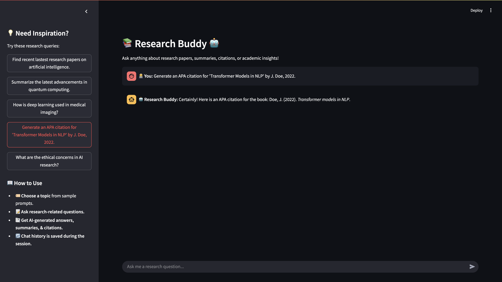

# 📚 Research Buddy AI Agent 🤖

**Research Buddy AI Agent** is an intelligent research assistant that helps users search for research papers, summarize academic content, generate citations, and answer research-related questions. Built using **Streamlit** for the frontend and **OpenAI Agents** for AI-driven research.

## 🚀 Features
✅ **Find research papers** from AI-powered searches  
✅ **Summarize research papers** for easy reading  
✅ **Generate citations** in APA & IEEE formats  
✅ **Answer research-related questions**  
✅ **Interactive chat interface** powered by Streamlit  

---

## 🖼️ UI Preview & AgentOps Dashboard

| Chatbot UI | AgentOps Dashboard |
|------------|-------------------|
|  |  |


## 📂 Project Structure
    .
    ├── app.py                                # main file to run the project
    ├── research_agents.py                    # contains AI agents written using OpenAPI Agents
    ├── requirements.txt                      # contains list of packages required to run the project
    ├── .gitignore
    └── README.md


---

## 🔧 Installation & Setup

### **Run the following commands**
```bash
git clone https://github.com/puneeth-bs/research_buddy_ai_agent.git

python -m venv .venv
source .venv/bin/activate  # On Windows: .venv\Scripts\activate

pip install -r requirements.txt

export OPENAI_API_KEY="your-api-key-here"

export AGENTOPS_API_KEY="your-api-key-here"


streamlit run app.py

